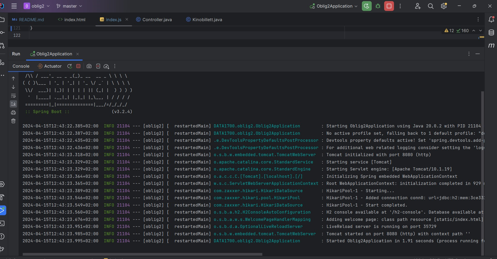
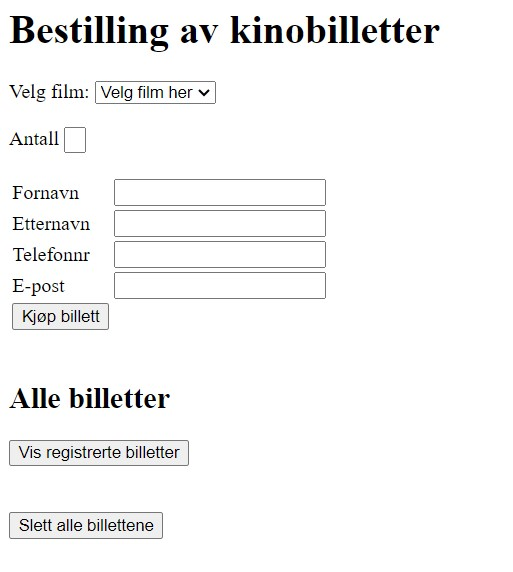
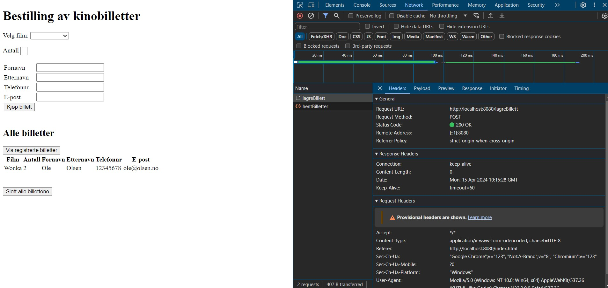
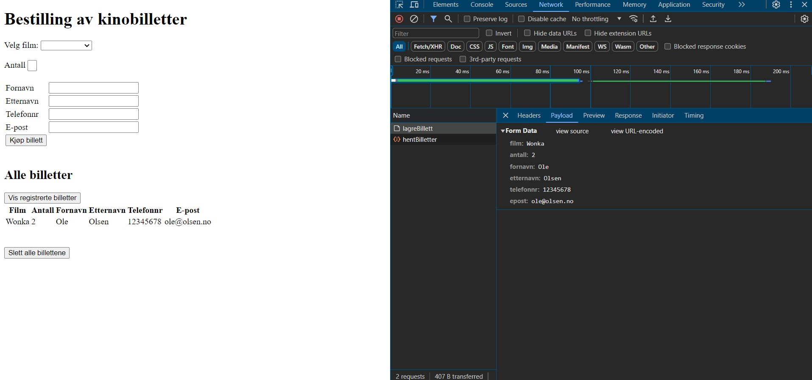
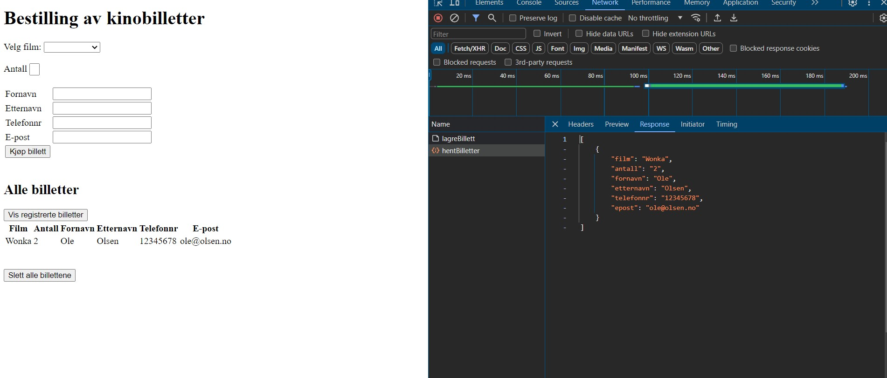
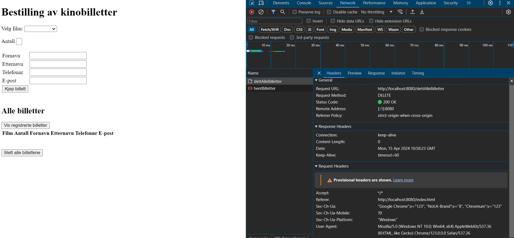
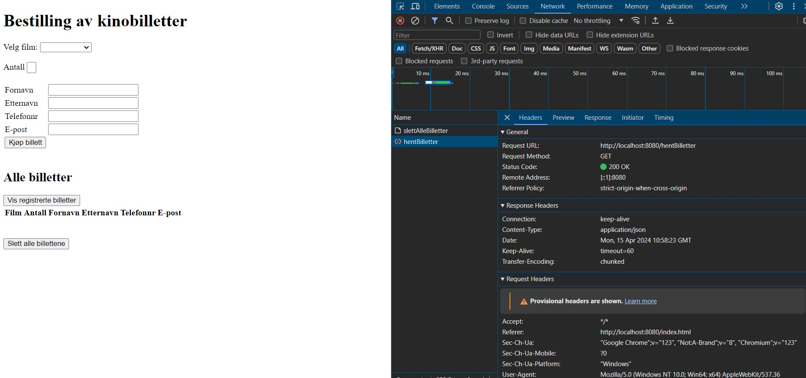

# Oblig 2 
OsloMet brukernavn: mahag2193

GitHub brukernavn: hagmal

GitHub repo URL: https://github.com/hagmal/oblig2.git

Fullt navn: Malin Rung Hagerud
***
Kort beskrivelse av applikasjon:

Oblig 1: Registrerer kjøp av kinobilletter. Etter at knappen "kjøp billett" er trykket, lagres billetten som et objekt i et array.
Arrayet med kjøpte billetter vises under "Alle billetter".
Har også med inputvalideringer.

Oblig 2: Flyttet lagring til tjener/server. Med get og postmapping. Sletter billettene med deletemapping.

Når man trykker "slett billetter"-knapp:

